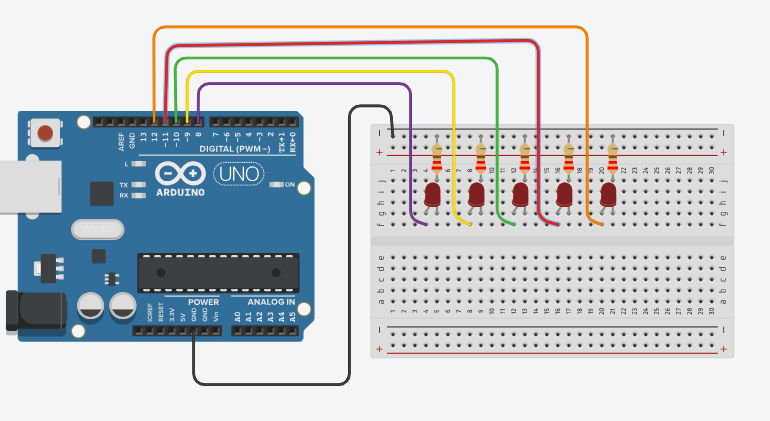

# Control-de-Leds-OpenCV-Python-Arduino
Circuito con LEDs simple controlado mediante gestos con las manos usando python-OpenCv y Arduino.

## Software 
- Python: versión 3.9.9
- OpenCV: librería CvZone
- Mediapipe
- Librería pyfirmata
- Arduino IDE y librería Firmata 

## Componentes:
- Protoboard
- 5 Leds
- 5 resistencias de 220 Ω
- Arduino UNO
- Cables jumper

## Diagrama

## Esquemático
Para descargar el video de demostración, hacer click en la imagen de abajo.

